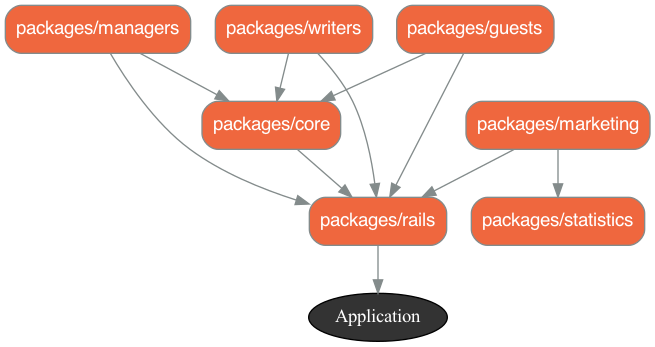
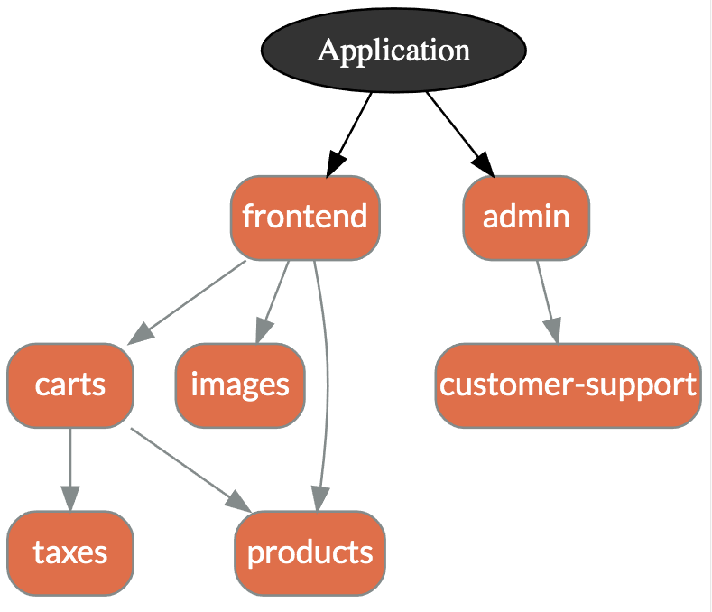
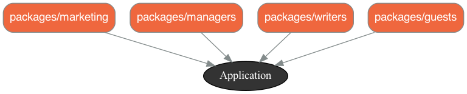
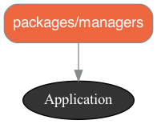
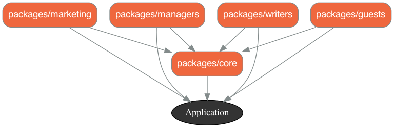
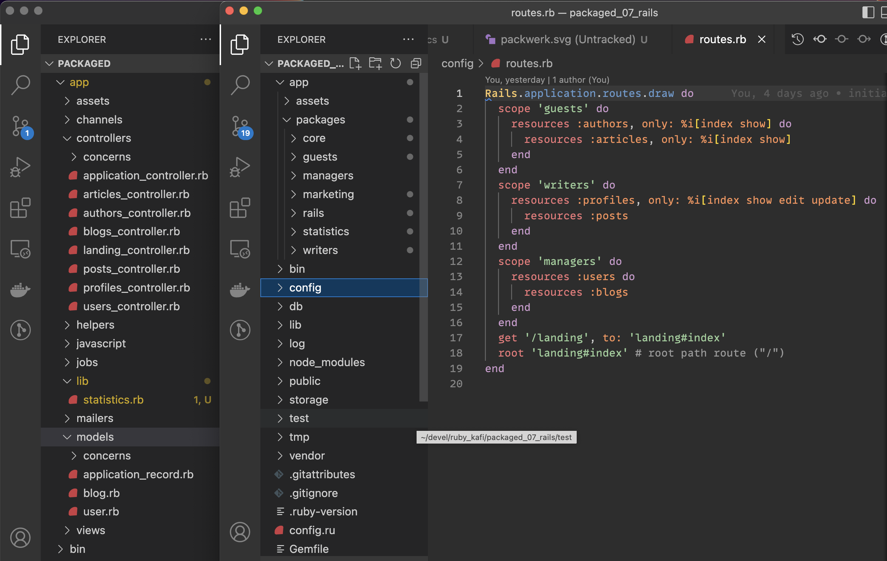

---
# try also 'default' to start simple
theme: seriph
# random image from a curated Unsplash collection by Anthony
# like them? see https://unsplash.com/collections/94734566/slidev
background: ./images/leone-venter-mTkXSSScrzw-unsplash.jpg
# apply any windi css classes to the current slide
class: 'text-center'
# https://sli.dev/custom/highlighters.html
highlighter: shiki
# show line numbers in code blocks
lineNumbers: false
# some information about the slides, markdown enabled
info: |
  ## Slidev Starter Template
  Presentation slides for developers.

  Learn more at [Sli.dev](https://sli.dev)
# persist drawings in exports and build
drawings:
  persist: false
# use UnoCSS (experimental)
css: unocss
---

# Packwerk for Rails

## Keep the monolith add Boundaries

<br>

Enjoy a gradual transition to a modular architechture with strong boundaries.

_(with much less ceremony than Rails Engines)_

<br>

presenter: **Bill Tihen**

---

# What is Packwerk

Gem that's validates software design linter _(checks dependency and privacy declarations)_

Zeitwerk is required as it enables software organization that reflects the software design _(through a few simple rails configuration entries)_

**REASON**

Shopify wanted to move to a `citadel` team structure - teams that can work relatively independly and provide a public API that others can use without knowing (and using the details) -- _**while keeping their Rails Monolith and without disrupting business and development cycles.**_

**Solution** - Packwerk

- **Explicit Code Structure** - Packages are organized within Folders
- **Explicit Dependencies** - to be enforced (or not while transitioning)
- **Explicit Public APIs** - to be enforced (or not while tranistioning)

_While transitioning it is also possible to enforce new code and have an exception list for old code._

In the resources are articles describing various stages of Shopify's process.

---

# Graphwerk

A gem that visually displays the summary of the package configs (define in `package.yml` files)



---

# Dependency Inversion

Shopify's Stephan Hagemann, (author of "Gradual Modularization for Ruby and Rails") recommends **dependency inversion** after organizing into packages.  (This can easily be accomplished with **dry-rails**)



---

# Install Packwerk

Add the packwerk and graphwerk gems to `./Gemfile`

```ruby
# Gemfile
...
# Packwerk (modular Rails) - dependency tooling and mapping
gem "packwerk", "~> 2.2"
gem 'graphwerk', group: %i[development test]
```

Now of course we need to install and intialize our new gems.

```bash
bundle install
# make it easy to
bundle binstub packwerk
# create intial packwerk config files
bin/packwerk init
```

Check that the gems work:

```bash
bin/packwerk check
bin/rails graphwerk:update
```

---

# Configure Packwerk / Rails

Create a place for packages:

```bash
mkdir app/packages
```

Tell Rails about the Packwerk package location:

```ruby
# config/application.rb
module Packaged
  class Application < Rails::Application
    ...
    # Zeitwerk config packages fur packwerk
    config.paths.add 'app/packages', glob: '*/{*,*/concerns}', eager_load: true
  end
end
```

Let the controllers know how to find the views and layouts.

```ruby
# app/controllers/application_controller.rb
class ApplicationController < ActionController::Base
  append_view_path(Dir.glob(Rails.root.join('app/packages/*/views')))
end
```
---

# package.yml

In Rails

I suggest leaving the default config in `./package.yml` (or use the advanced privacy settings) - as Rails wasn't particulary designed with boundaries in mind.

```yaml
# app/packages/managers/package.yml
# Turn on dependency checks for this package
enforce_dependencies: true

# Turn off privacy checks for rails (or list exceptions)
# - ApplicationController, ApplicationRecord, etc
enforce_privacy: false

# this allows you to modify what your package's public path is within the package
# code that this package publicly shares with other packages
public_path: public/

# A list of this package's dependencies
# Note that packages in this list require their own `package.yml` file
# '.' - we are dependent on the root application
# dependencies:
# - '.'
```

---

# Route Driven Design?

I have found it helpful to use Rails Routes (user interactions) as a starting place for packaging.

Here we see how the application looks from the outside - without code coupling biases.

```ruby
Rails.application.routes.draw do
  scope 'guests' do
    resources :authors, only: %i[index show] do
      resources :articles, only: %i[index show]
    end
  end
  scope 'writers' do
    resources :profiles, only: %i[index show edit update] do
      resources :posts
    end
  end
  scope 'managers' do
    resources :users do
      resources :blogs
    end
  end
  get '/landing', to: 'landing#index'
  root 'landing#index' # root path route ("/")
end
```

---

# Packaging (Actions)

Starting with:

- Marketing
- Managers
- Writers
- Guests

These controllers and actions are outward facing and nothing depends on them.

So our first refactoring targets the following design.



---

# Marketing Package

Create the Marketing structure (basically mirror Rails folders inside a Package):

```bash
mkdir app/packages/managers
mkdir app/packages/managers/model
mkdir app/packages/managers/public
mkdir app/packages/managers/views
mkdir app/packages/managers/controllers
cp package.yml app/packages/managers/package.yml
```

Now copy the needed code (controllers & views - no unqiue models in this case):
```bash
mv app/controllers/blogs_controller.rb app/packages/managers/controllers/blogs_controller.br
mv app/controllers/users_controller.rb app/packages/managers/controllers/users_controller.rb
mv app/views/blogs app/packages/managers/views/blogs
mv app/views/users app/packages/managers/views/users
```

Run the tests and be sure that everything still works!


---

# package.yml

In Packages

Now we need to configure our declared dependencies and what to enforce (in our case everything)

```yaml
# app/packages/managers/package.yml
# Turn on dependency checks for this package
enforce_dependencies: true

# Turn on privacy checks for this package
enforce_privacy: true

# this allows you to modify what your package's public path is within the package
# code that this package publicly shares with other packages
public_path: public/

# A list of this package's dependencies
# Note that packages in this list require their own `package.yml` file
# '.' - we are dependent on the root application
dependencies:
- '.'
```

---

# Packwerk Checks

Now that the code works and the package is configure, lets generate a new diagram of our app using:
```bash
bin/rails graphwerk:update
```

If all is well the new graph in `packwerk.png` will look like:



Let's check for package problems with (ideally none):

```bash
bin/packwerk check
...
No offenses detected
No stale violations detected
```

---

# Repeat Packaging

Following the same process for the other areas of code.

- Marketing
- Writers
- Guests

_(Copying `package.yml` from managers since its already configured)_

- `bin/packwerk check` shouldn't find problems.
- `bin/rails graphwerk:update` our packages / dependencies look like:


---

# Package Core

Now it gets interesting

We have code (our models) common to packages (but not part of Rails).

```bash
mkdir app/packages/core
mkdir app/packages/core/public
mkdir app/packages/core/models
cp app/packages/managers/package.yml app/packages/core/package.yml
```

Copy the code (models):

```bash
mv app/models/blog.rb app/packages/core/models/blog.rb
mv app/models/user.rb app/packages/core/models/user.rb
```

Run our tests (probably they work)

Run `bin/packwerk check` - **OOPS MANY ERRORS!**


---

# Problems

Only two unique issues (across many files / packages)

**Dependency** - we depend on packages that are not declared in `package.yml`

```txt
app/packages/writers/controllers/posts_controller.rb:21:12
Dependency violation: ::Blog belongs to 'app/packages/core', but 'app/packages/writers'
does not specify a dependency on 'app/packages/core'.
Are we missing an abstraction?
Is the code making the reference, and the referenced constant, in the right packages
```

**Privacy** - we access code in a package (a dependency) not located within the packages `public` folder

```txt
app/packages/writers/controllers/profiles_controller.rb:5:16
Privacy violation: '::User' is private to 'app/packages/core' but referenced from 'app/packages/writers'.
Is there a public entrypoint in 'app/packages/core/public/' that you can use instead?
```


---

# Dependency Fix

Add `app/packages/core` as a dependency in the package.yml files of `managers`, `writers` and `guests` (as they now depend on core)

These `package.yml` files will now look like:

```yaml
# Turn on dependency checks for this package
enforce_dependencies: true

# Turn on privacy checks for this package
enforce_privacy: true

# this allows you to modify what your package's public path is within the package
# code that this package publicly shares with other packages
public_path: public/

# A list of this package's dependencies
# Note that packages in this list require their own `package.yml` file
# '.' - we are dependent on the root application
dependencies:
- 'app/packages/core' # not needed in marketing
- '.'
```

Now `bin/packwerk check` should only have **Privacy** errors _(if not fix the package.yml with errors)_

---

# Privacy Fix

As you have seen in our `package.yml` files we defined the setting `public_path: public/`

So we need to move our models into core's public folder:

```bash
mv app/packages/core/models/blog.rb app/packages/core/public/blog.rb
mv app/packages/core/models/user.rb app/packages/core/public/user.rb
```

Now `bin/packwerk check` should run error free.

**NOTE:** Public code isn't allowed a structure (at least now without more configuration). This is reality is unlikely to be a problem, since most likely this folder is expected to have a defined **API** here for usage of this package / module.

---

# Dependencies w/ Core Package

Now we have fully separated code we wrote from rails machinery.



The `app` file structure is still _messy_ can we fix that by packaging rails?

---

# Packaging **Rails**

Create a Rails Shim of sorts

Our Current `app/packages` file structure is now clear, but `app` is still messy.  We can clean this up by packaging rails too!

```bash
mkdir app/packages/rails
cp ./package.yml app/packages/rails/package.yml
```

**NOTE:** Copy the `./package.yml` since it is what we were using before for rails (privacy is disabled).  Rails wasn't designed for privacy so it is easiest just to ignore privacy here!

Move everything remaining (our rails files)

- app/assets
- app/packages

into `app/packages/rails`

Test our app again and be sure all is well.

---

# Fix Rails Dependency

`bin/packwerk check` shows many packages (managers, writers, guests, marketing and core) haven't declared `app/packages/rails`, they are still using `.` -- so we adjust these files to look like:

```yaml
# Turn on dependency checks for this package
enforce_dependencies: true

# Turn on privacy checks for this package
enforce_privacy: true

# this allows you to modify what your package's public path is within the package
# code that this package publicly shares with other packages
public_path: public/

# A list of this package's dependencies
# Note that packages in this list require their own `package.yml` file
# '.' - we are dependent on the root application
dependencies:
- 'app/packages/core' # not needed in marketing (or core)
- 'app/packages/rails'
```

Now `bin/packwerk check` should be clean.

---

# Final Checks

- `bin/packwerk check` - is clean
- `bin/rails graphwerk:update` results in:


---

# Packaged File Structure



If using namespaces (or scopes within the routing) then the file structure and routes will even match

---

# Summary

## Benefits

- Allows for excellent organization and CI enforcement that dependency and package APIs are respected.

- Allows Rails to organize similar to Hanami Apps while keeping the familiarity and benefits of rails.

**Note:** with `dry-rails` rails can also easily adopt many architectural features used in Hanami, such as, dependency registr, event handling, etc

## Wish list

- `public` used the rails structure (or insisted on an api structure) - I assume the anything goes is inline with the easy transition concept of packwerk
- optionally allow graphwerk to ignore dependencies (most packages will depend on rails within a rails app)

---

# Discussion

---

# Packwerk Resources

Helpful resources for Packwerk

**Code**

* [Shopify - Packwerk Code](https://github.com/Shopify/packwerk)
* [graphwerk - dependency mapper](https://github.com/bellroy/graphwerk)

**Documentation and Articles**

* [Shopify - Packwerk Docs](https://github.com/Shopify/packwerk/blob/main/USAGE.md)
* [Shopify - Video introducing Packwerk](https://www.youtube.com/watch?v=olEA157z7kU)
* [Shopify - on Monoliths](https://www.shopify.com/partners/blog/monolith-software)
* [Shopify - enforcing-modularity-rails-apps-packwerk](https://shopify.engineering/enforcing-modularity-rails-apps-packwerk)
* [Package-Based-Rails-Applications Book](https://leanpub.com/package-based-rails-applications), by Stephan Hagemann
* [modularization-with-packwerk](https://thecodest.co/blog/ruby-on-rails-modularization-with-packwerk-episode-i/)
* [packwerk-to-delimit-bounded-contexts](https://www.globalapptesting.com/engineering/implementing-packwerk-to-delimit-bounded-contexts)
